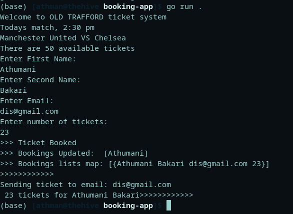

# Booking App
> :bulb: **tip** Project 1 / 12
## Description
> This is a simple GoLang CLI application that I developed to kick start my skills as a Golang dev
> It has different main things why you should use Golang such as :
  * Use of structs and maps
  * Showcasing concurrency in Go
    * Use of Wait Groups
## How to run the code
    1. Clone the repo
        ```
            git clone 

        ```
    1. Move into the project file
        ```bash
            cd booking-app

        ```
    1. Run the code
        ```
            go run .

        ```
## Running Code Snippet



