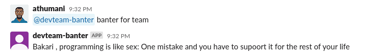
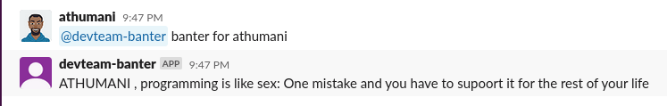
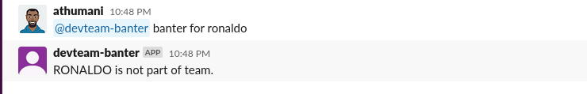
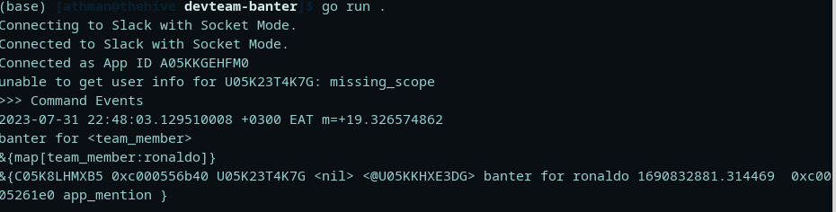

# :moyai: DEVTEAM-BANTER SLACK BOT 
> :bulb: **Project** 5 / 12

## 💬 Description
> This is a simple slack bot for your slack chat. It receives the text "banter for <team_member>" and returns a jokes for the specified team member
## 📜 More
> The flow takes the text from the slack app as a request and checks for the required parameter to return a response.
  1. For the 'team' parameter
     > returns a random banter from the slice that holds different banters to a random team member
      
  1. For a specific team member 
     > The bot checks is the specified team member is part of the team , if that is true it returns a random joke from the banters slice directed to that member.
      
  1. For a non-team member
     > The bot checks if the username given is part of the team members (it is found in the team memembers slice), if the username is not found a response is returned that shows that the username is not part of the team
      

## 🔧 Code Setup
   1. Clone the repo
        ```
            git clone https://github.com/devoure/go-mini-projects.git

        ```
   1. Move into the project file
        ```bash
            cd devteam-banter

        ```
   1. Install the dependecies
        ```bash
            go get "github.com/shomali11/slacker"

        ```

   1. Run the code
        ```bash
            go run main.go

        ```
## 💻🏃‍♂️ Running Code Snippet



