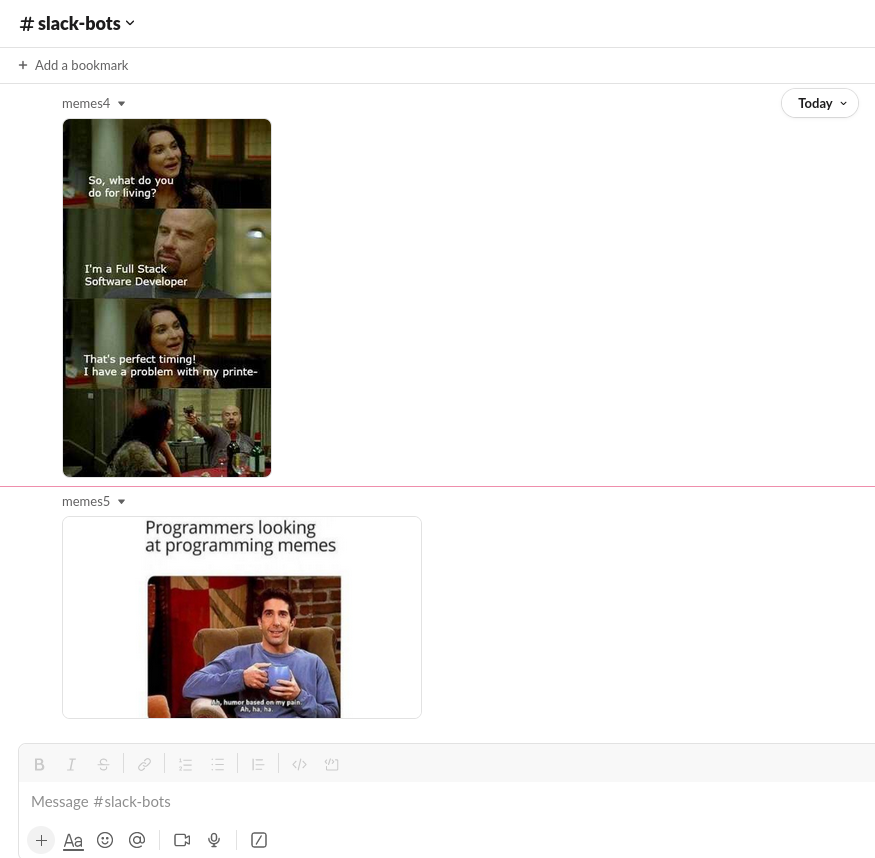
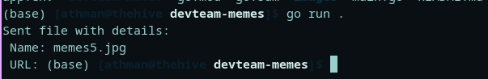

# :jack_o_lantern: DEVTEAM-MEMES SLACK BOT 
> :bulb: **Project** 6 / 12

## 💬 Description
> This is a simple slack bot for your slack chat. It sends random memes from a slice of memes to the chat
## 📜 More
> The app takes a random number generated by math/rand and uses it to get a random memes and sends it to the chat when the program is run


## 🔧 Code Setup
   1. Clone the repo
        ```
            git clone https://github.com/devoure/go-mini-projects.git

        ```
   1. Move into the project file
        ```bash
            cd devteam-memes

        ```
   1. Install the dependecies
        ```bash
            go get "github.com/slack-go/slack"
            go get "github.com/joho/godotenv"

        ```

   1. Run the code
        ```bash
            go run main.go

        ```
## 💻🏃‍♂️ Running Code Snippet



