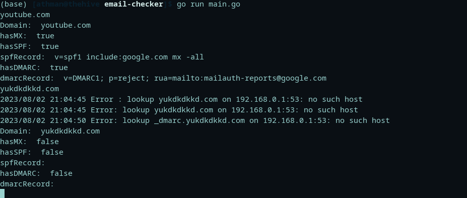

# :e-mail: DOMAIN MAIL CHECKER
> :bulb: **Project** 7 / 12

## 💬 Description
> This is a simple CLI golang application that checks a given domain name for features such as MX, SPF and DMARC 
## 📜 More
> The program uses the .net package of go to get the lookup TXT and MX to check if the string has variables such show the features described above


## 🔧 Code Setup
   1. Clone the repo
        ```
            git clone https://github.com/devoure/go-mini-projects.git

        ```
   1. Move into the project file
        ```bash
            cd email-checker 

        ```

   1. Run the code
        ```bash
            go run main.go

        ```
## 💻🏃‍♂️ Running Code Snippet



