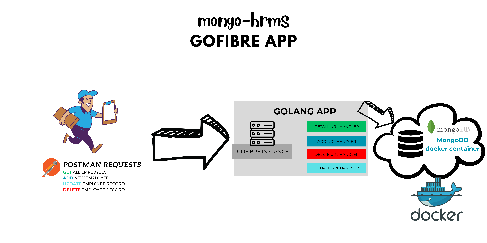
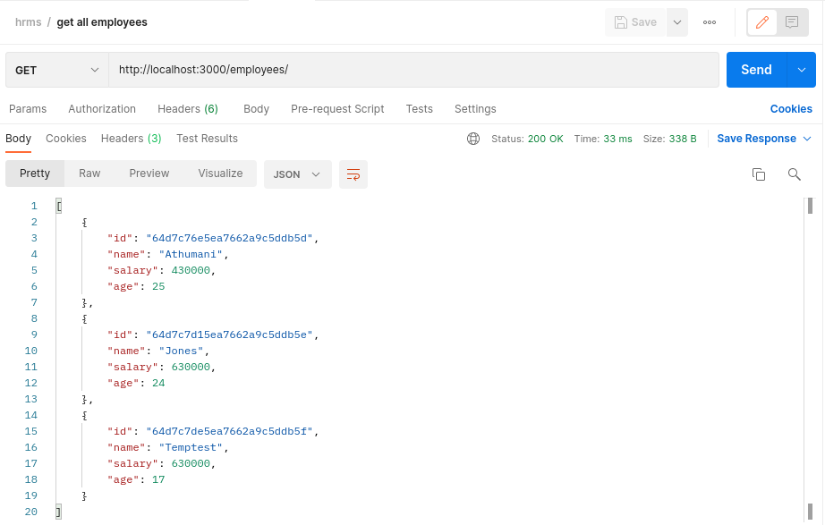
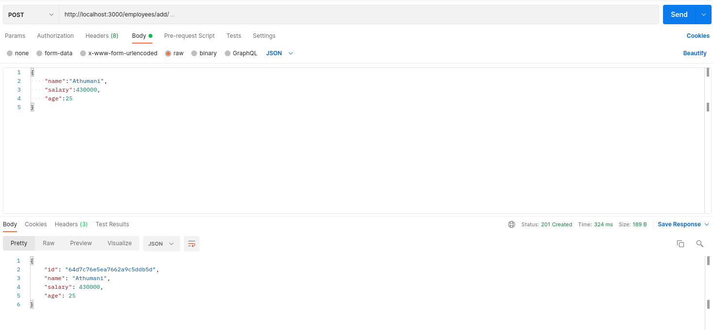
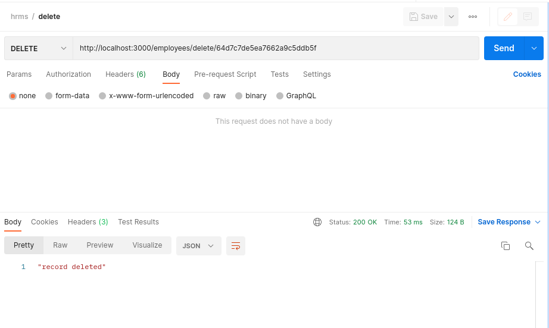
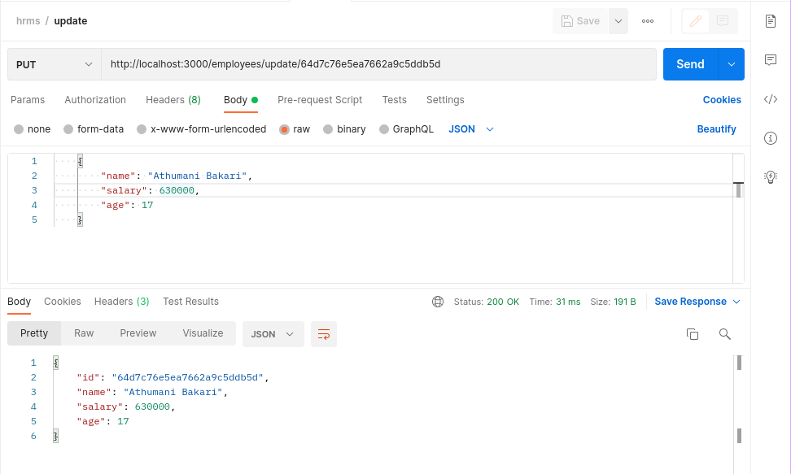
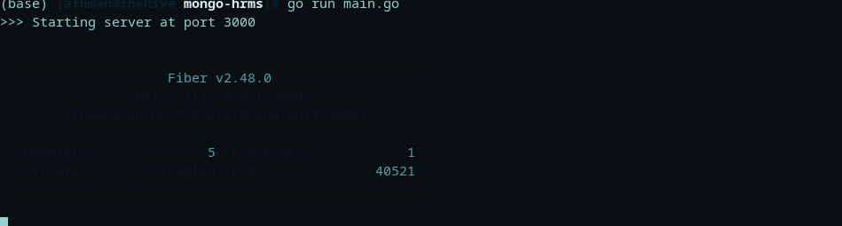

# :construction_worker: HRMS
> :bulb: **Project** 9 / 12
## 💬 Description
> This is a simple HRMS (Human Resourse Management Software) that is build with golang fibre and mongodb docker container

## 📜 More
> The application handles 4 functions
  1. Get all employees data
     > This endpoint "localhost:3000/employees/" (GET request) is handled and returns all the customers details in the MongoDB database
     <details>
      <summary>Postman screenshot</summary>
      
      
     </details>
  1. Create a new employee record
     > This endpoint "localhost:3000/employees/add/" (POST request) adds a new employee records passed through the body of the request into the database
     <details>
      <summary>
       Postman Screenshot
      </summary>
       
      
     </details>
  1. Delete a employee record
     > This endpoint "localhost:3000/employees/delete/{id}" (DELETE request) deletes a employee record that matches the id passed from the database
     <details>
      <summary>
       Postman Screenshot
      </summary>
       
      
     </details>
  1. Update a employee record
     > This endpoint "localhost:8000/employees/update/{id}" (PUT request) updates a employee record that matches the id with new details passed in the body of the request in the database
     <details>
      <summary>
       Postman Screenshot
      </summary>
       
      
     </details>

## 🔧 Code Setup
   1. Clone the repo
        ```
            git clone https://github.com/devoure/go-mini-projects.git

        ```
   1. Move into the project file
        ```bash
            cd mongo-hrms

        ```
   1. Install the dependecies
        ```bash
            go mod tidy

        ```

   1. Pull and run docker MongoDB image
        ```bash
            docker pull mongo
            docker pull mongo-express
            docker-compose -f mongo-docker/mongo.yaml up

        ```

   1. Run the code
        ```bash
            go run main.go

        ```
## 💻🏃‍♂️ Running Code Snippet



