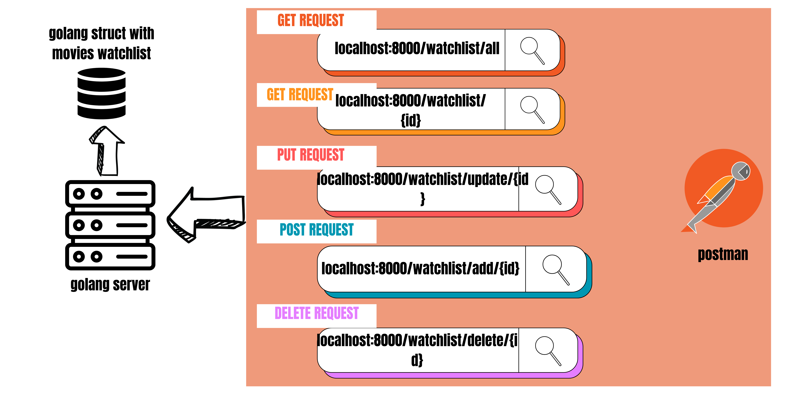
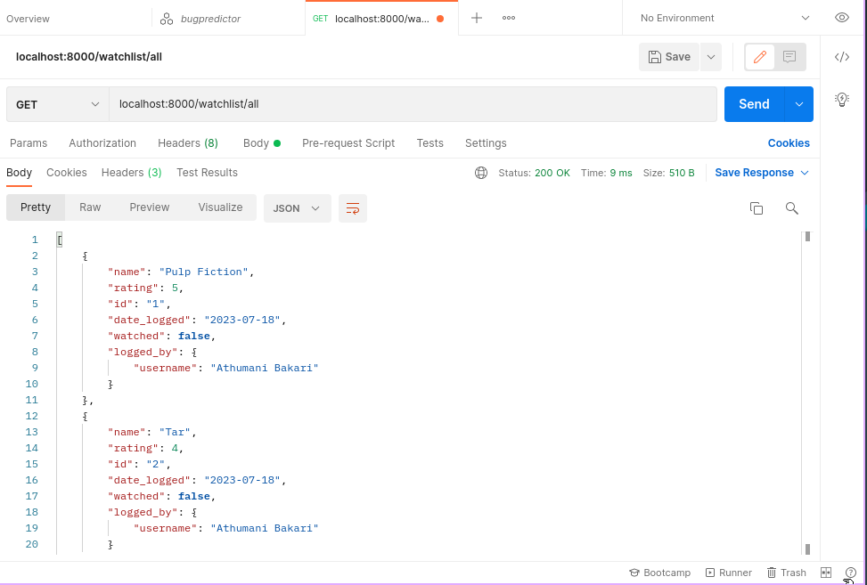
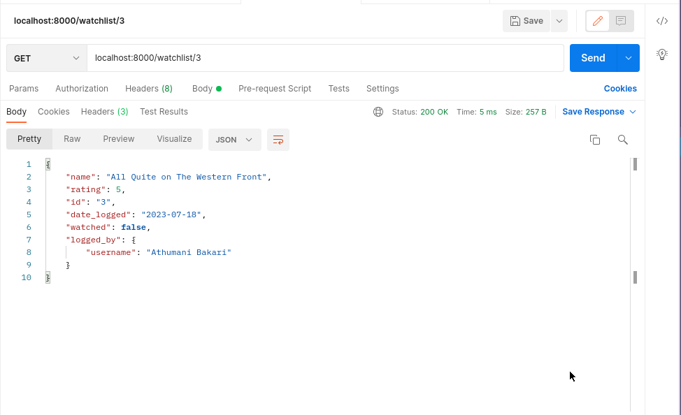
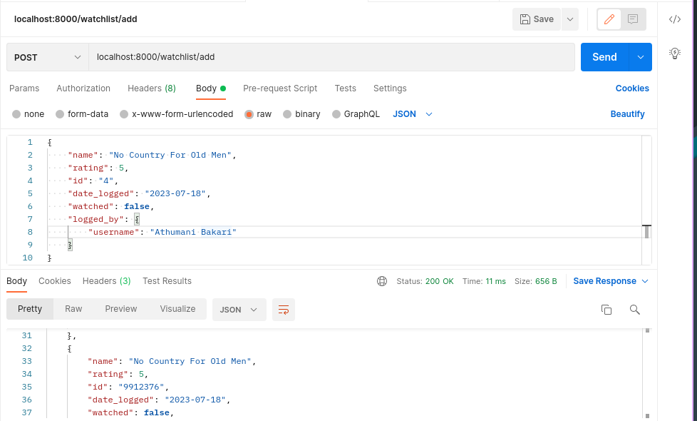
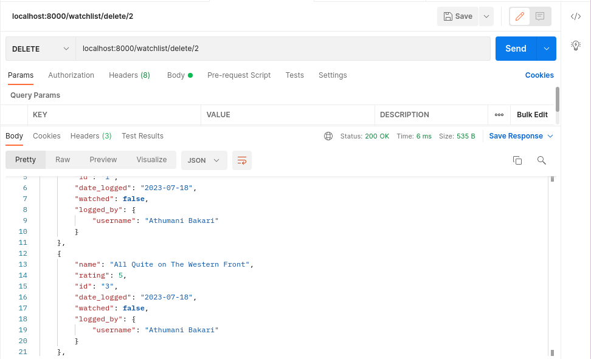
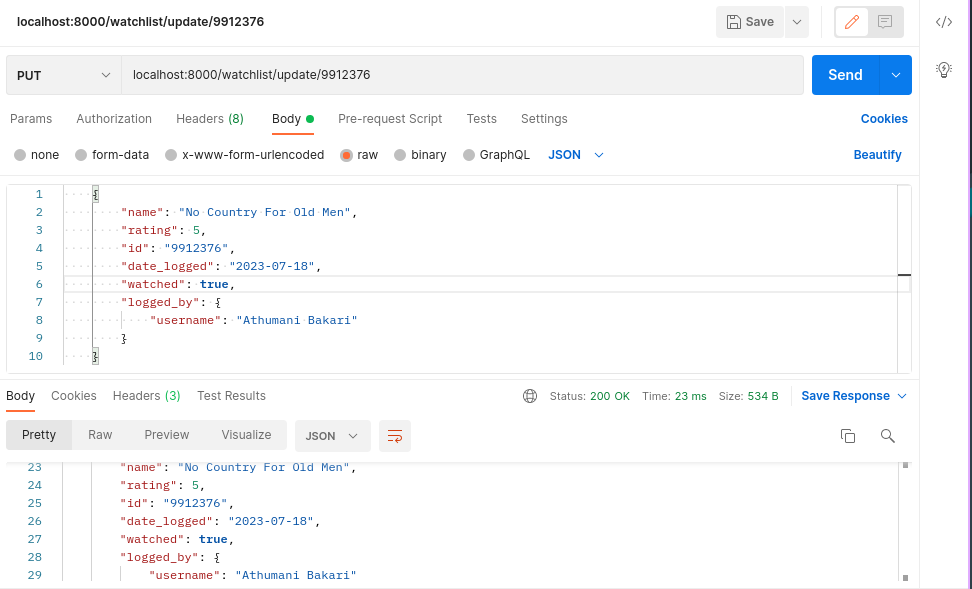
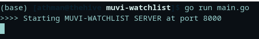

# :movie_camera: Muvi Watchlist CRUD API
> :bulb: **Project** 3 / 12
## 💬 Description
> This is a simple CRUD API built with Golang that allows a user to view, add, update and delete movies in his/her watchlist saved on a golang struct. The application is tested with Postman endpoints.

## 📜 More
> The application handles 5 different endpoints 
  1. /watchlist/all (GET) endpoint
     > This endpoint "localhost:8000/watchlist/all" is handled by the getWatchlist handleFunc whichis a function that returns all the movies in the myWatchlist struct
     <details>
      <summary>Postman screenshot</summary>
      
      
     </details>
  1. /watchlist/{id} (GET) endpoint
     > This endpoint "localhost:8000/watchlist/{id}" is handled by the getEntry handleFunc which is a function that returns the specified movie by the parameter {id} from the myWatchlist struct
     <details>
      <summary>
       Postman Screenshot
      </summary>
       
      
     </details>
  1. /watchlist/add (POST) endpoint
     > This endpoint "localhost:8000/watchlist/add" is handled by the createEntry handleFunc which is a function that returns a list of the new watchlist after adding the specified movie from the body of the request to the myWatchlist struct
     <details>
      <summary>
       Postman Screenshot
      </summary>
       
      
     </details>
  1. /watchlist/{id} (DELETE) endpoint
     > This endpoint "localhost:8000/watchlist/{id}" is handled by the deleteEntry handleFunc which is a function that returns an updated list of the myWatchlist struct after deleting an entry specified by the {id} parameter
     <details>
      <summary>
       Postman Screenshot
      </summary>
       
      
     </details>
  1. /watchlist/{id} (PUT/UPDATE) endpoint
     > This endpoint "localhost:8000/watchlist/{id}" is handled by the updateWatchlist handleFunc which is a function that returns an updated list of the myWatchlist struct after updating an entry specified by the {id} parameter
     <details>
      <summary>
       Postman Screenshot
      </summary>
       
      
     </details>

## 🔧 Code Setup
   1. Clone the repo
        ```
            git clone https://github.com/devoure/go-mini-projects.git

        ```
   1. Move into the project file
        ```bash
            cd muvi-watchlist

        ```
   1. Install the dependecies
        ```bash
            go get "github.com/gorilla/mux"

        ```

   1. Run the code
        ```bash
            go run main.go

        ```
## 💻🏃‍♂️ Running Code Snippet



