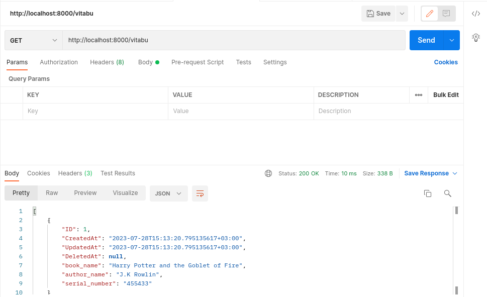
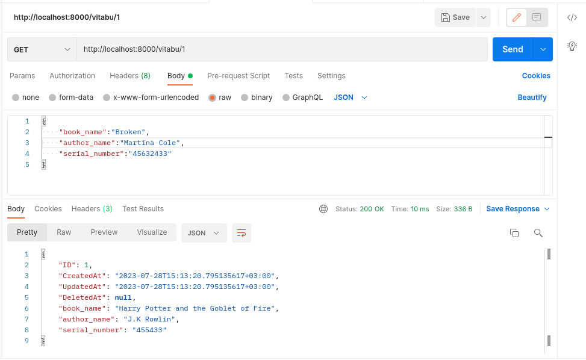
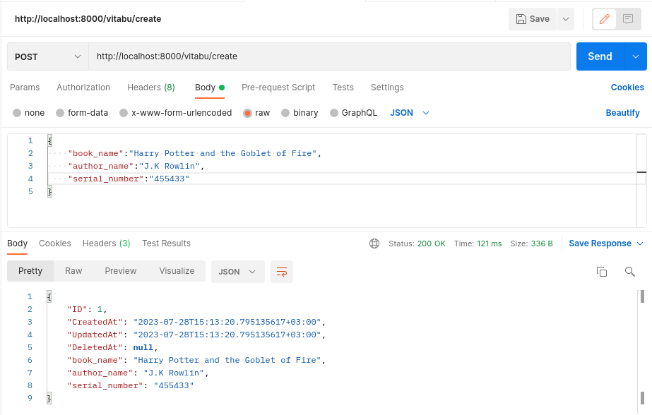
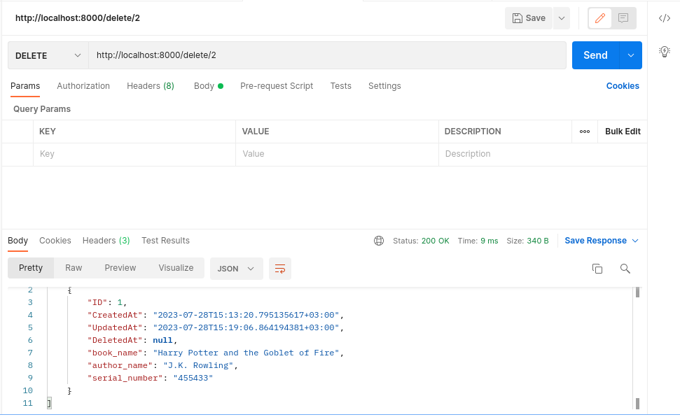
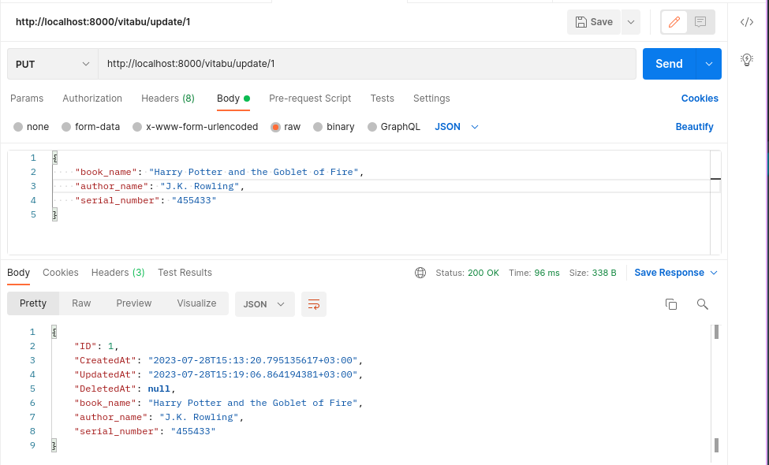
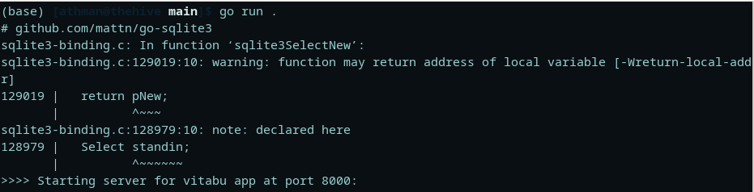

# :books: SQL BOOKSTORE CRUD API
> :bulb: **Project** 4 / 12
## 💬 Description
> This is a simple CRUD API built with Golang that allows a user to view, add, update and delete books to manage a bookstore of books  saved on a SQLite database. The application is tested with Postman endpoints.
.png)
## 📜 More
> The application handles 5 functions
  1. Get all books
     > This endpoint "localhost:8000/vitabu" (GET request) is handled by the getBooks handleFunc which is a function that returns all books from the database
     <details>
      <summary>Postman screenshot</summary>
      
      
     </details>
  1. Get book by ID 
     > This endpoint "localhost:8000/vitabu/{id}" (GET request) is handled by the getBookById handleFunc which is a function that returns the specified book by the parameter {id} from the database
     <details>
      <summary>
       Postman Screenshot
      </summary>
       
      
     </details>
  1. Create a new book record
     > This endpoint "localhost:8000/vitabu/create" (POST request) is handled by the createBookRecord handleFunc which is a function that returns a list of all books after adding the specified book from the body of the request to the database
     <details>
      <summary>
       Postman Screenshot
      </summary>
       
      
     </details>
  1. Delete a book record
     > This endpoint "localhost:8000/vitabu/delete/{id}" (DELETE request) is handled by the deleteBookRecord handleFunc which is a function that returns an updated list of the books after deleting an entry specified by the {id} parameter
     <details>
      <summary>
       Postman Screenshot
      </summary>
       
      
     </details>
  1. Update a book record
     > This endpoint "localhost:8000/vitabu/update/{id}" (PUT request) is handled by the updateBookRecord handleFunc which is a function that returns an updated list of the books after updating an entry specified by the {id} parameter
     <details>
      <summary>
       Postman Screenshot
      </summary>
       
      
     </details>

## 🔧 Code Setup
   1. Clone the repo
        ```
            git clone https://github.com/devoure/go-mini-projects.git

        ```
   1. Move into the project file
        ```bash
            cd vitabu

        ```
   1. Install the dependecies
        ```bash
            go get "github.com/gorilla/mux"
            go get "github.com/jinzhu/gorm"
            go get "github.com/jinzhu/dialects/sqlite"

        ```

   1. Run the code
        ```bash
            go run main.go

        ```
## 💻🏃‍♂️ Running Code Snippet



