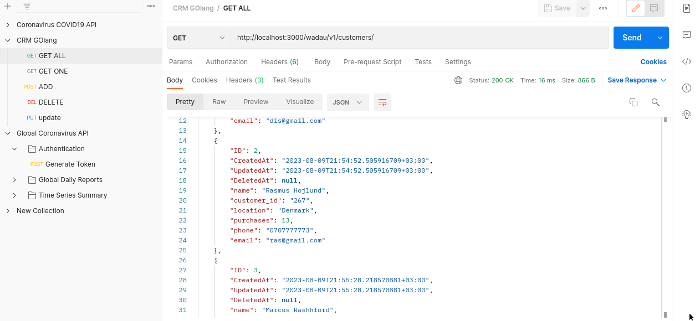

# :two_men_holding_hands: WADAU CRM GOFIBRE APP
> :bulb: **Project** 8 / 12
## 💬 Description
> This is a simple CRM (Customer Relationship Management) API APP created with GOFIBRE framework.

## 📜 More
> The application handles 5 functions
  1. Get all customer data
     > This endpoint "localhost:3000/wadau/v1/customers/" (GET request) is handled and returns all the customers details in the sqlite database
     <details>
      <summary>Postman screenshot</summary>
      
      
     </details>
  1. Get one customer
     > This endpoint "localhost:3000/wadau/v1/customers/{id}" (GET request) returns a single customer that matches the ID passed from the SQLite database
     <details>
      <summary>
       Postman Screenshot
      </summary>
       
      
     </details>
  1. Create a new customer record
     > This endpoint "localhost:3000/wadau/v1/customers/add/{id}" (POST request) adds a new customer records passed through the body of the request into the database
     <details>
      <summary>
       Postman Screenshot
      </summary>
       
      
     </details>
  1. Delete a customer record
     > This endpoint "localhost:3000/wadau/v1/customers/delete/{id}" (DELETE request) deletes a customer record that matches the id passed from the database
     <details>
      <summary>
       Postman Screenshot
      </summary>
       
      
     </details>
  1. Update a customer record
     > This endpoint "localhost:8000/vitabu/update/{id}" (PUT request) updates a customer record that matches the id with new details passed in the body of the request in the database
     <details>
      <summary>
       Postman Screenshot
      </summary>
       
      
     </details>

## 🔧 Code Setup
   1. Clone the repo
        ```
            git clone https://github.com/devoure/go-mini-projects.git

        ```
   1. Move into the project file
        ```bash
            cd wadau-crm

        ```
   1. Install the dependecies
        ```bash
            go get "github.com/gofibre/fibre"
            go get "github.com/jinzhu/gorm"
            go get "github.com/jinzhu/dialects/sqlite"

        ```

   1. Run the code
        ```bash
            go run main.go

        ```
## 💻🏃‍♂️ Running Code Snippet


